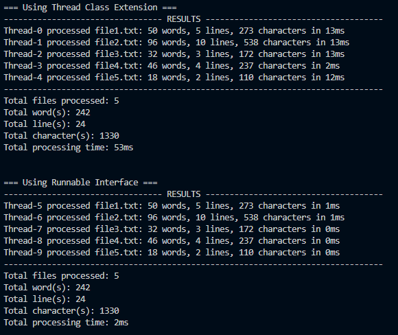
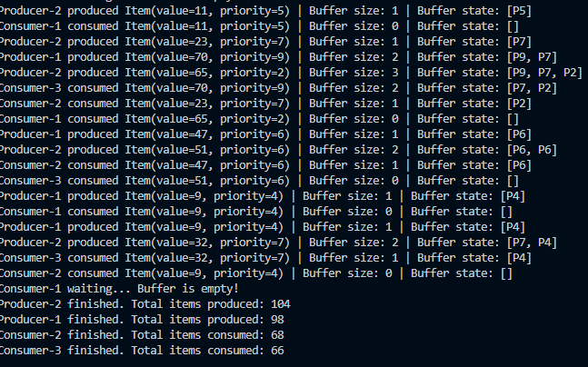
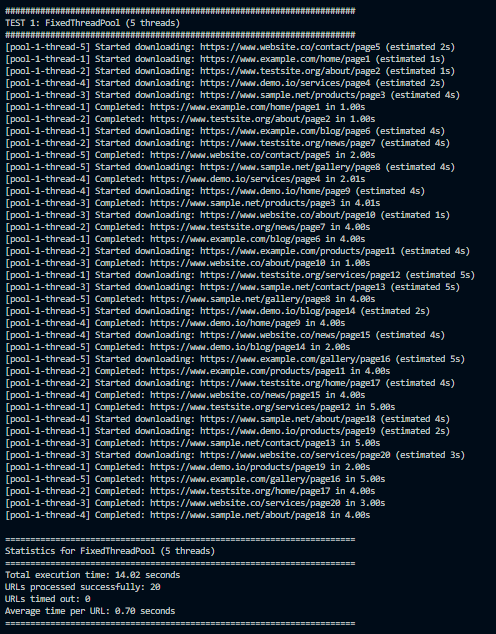
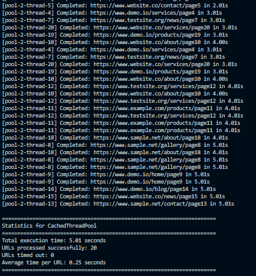
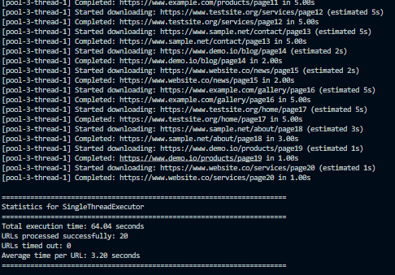
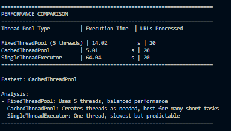
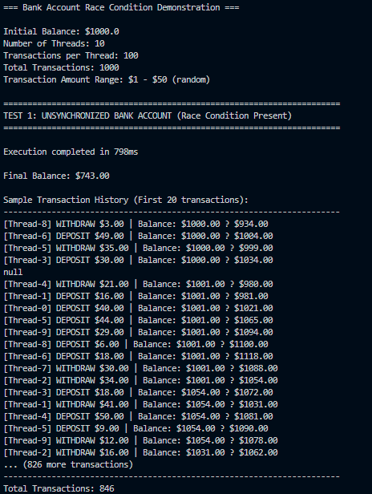
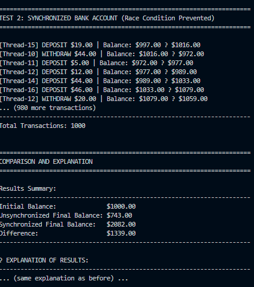

# Software Engineering Lab 05 - Multithreading

## Student Information
- **Name:** THY SETHASARAKVATH
- **Student ID:** P20230035
- **Course:** Software Engineering Concepts
- **Lab:** Lab 05 - Concept of Multithreading

---

## Lab Overview

This lab demonstrates practical implementation of multithreading and concurrency concepts in Java through four comprehensive tasks:

1. **File Processing with Multithreading**
2. **Producer-Consumer with Priority Queue**
3. **Thread Pool Web Crawler Simulation**
4. **Bank Account Race Condition Demonstration**

---

## Table of Contents

- [Software Engineering Lab 05 - Multithreading](#software-engineering-lab-05---multithreading)
  - [Student Information](#student-information)
  - [Lab Overview](#lab-overview)
  - [Table of Contents](#table-of-contents)
  - [Task 1: File Processing with Multithreading](#task-1-file-processing-with-multithreading)
    - [Description](#description)
    - [Files](#files)
    - [Features](#features)
    - [Setup](#setup)
    - [How to Run](#how-to-run)
    - [Output](#output)
  - [Task 2: Producer-Consumer with Priority Queue](#task-2-producer-consumer-with-priority-queue)
    - [Description](#description-1)
    - [Files](#files-1)
    - [Features](#features-1)
    - [How to Run](#how-to-run-1)
    - [Output](#output-1)
  - [Task 3: Thread Pool Web Crawler Simulation](#task-3-thread-pool-web-crawler-simulation)
    - [Description](#description-2)
    - [Files](#files-2)
    - [Features](#features-2)
    - [How to Run](#how-to-run-2)
    - [Output](#output-2)
  - [Task 4: Bank Account Race Condition Demonstration](#task-4-bank-account-race-condition-demonstration)
    - [Description](#description-3)
    - [Files](#files-3)
    - [Features](#features-3)
    - [How to Run](#how-to-run-3)
    - [Expected Output](#expected-output)

---

## Task 1: File Processing with Multithreading

### Description
A Java program that reads multiple text files concurrently using threads. Each thread processes a different file and counts words, lines, and characters.

### Files
- `FileStats.java` - Data class to store file statistics
- `FileProcessorThread.java` - Implementation using Thread class extension
- `FileProcessorRunnable.java` - Implementation using Runnable interface
- `FileProcessingMultithreading.java` - Processing Logic
- `Main.java` - Entry Point

### Features
- ✅ Implements both Thread class and Runnable interface approaches
- ✅ Processes multiple files concurrently (limited to 3 threads at a time)
- ✅ Counts words, lines, and characters in each file
- ✅ Measures and displays execution time for each thread
- ✅ Handles file exceptions properly
- ✅ Displays comprehensive summary of results

### Setup
1. Create a folder named `bunchOfFiles` in the project directory
2. Add at least 5 text files (.txt) with varying content sizes
3. Optionally add non-text files to test exception handling

### How to Run

Run `Main.java`

### Output

---

## Task 2: Producer-Consumer with Priority Queue

### Description
Implementation of the classic Producer-Consumer pattern using a priority queue as the shared buffer. Items are processed based on priority (highest first).

### Files
- `PriorityItem.java` - Class representing an item with value and priority
- `SharedPriorityBuffer.java` - Shared buffer with priority queue and synchronization
- `Producer.java` - Producer thread generating random items
- `Consumer.java` - Consumer thread processing items by priority
- `ProducerConsumerPriorityQueue.java` - orchestration logic (start threads, wait, call stats)
- `Main.java` - Entry Point

### Features
- ✅ Priority queue with capacity of 10
- ✅ 2 producer threads generating random numbers (1-100) with random priorities (1-10)
- ✅ 3 consumer threads processing highest priority items first
- ✅ Runs for 30 seconds
- ✅ Proper synchronization using `synchronized`, `wait()`, and `notifyAll()`
- ✅ Displays buffer state after each operation
- ✅ Shows statistics for each producer and consumer

### How to Run
Run `Main.java`

### Output

---

## Task 3: Thread Pool Web Crawler Simulation

### Description
Simulates a web crawler using different thread pool types to compare their performance characteristics.

### Files
- `WebPageTask.java` - Runnable task simulating web page download
- `CrawlerStats.java` - Class to store and display crawler statistics
- `WebCrawlerSimulator.java` - orchestration logic (runs tests with different thread pools)
- `Main.java` - Entry Point

### Features
- ✅ Simulates downloading 20 URLs
- ✅ Random download time (1-5 seconds per page)
- ✅ Tests three thread pool types:
  - **FixedThreadPool** (5 threads)
  - **CachedThreadPool** (dynamic thread creation)
  - **SingleThreadExecutor** (1 thread)
- ✅ Timeout handling (max 10 seconds per page)
- ✅ Measures total execution time for each pool type
- ✅ Displays which thread processed each URL
- ✅ Performance comparison with analysis

### How to Run
Run `Main.java`

### Output

---

## Task 4: Bank Account Race Condition Demonstration

### Description
Demonstrates race conditions in concurrent programming and shows how synchronization prevents data corruption.

### Files
- `Transaction.java` - Represents a single transaction
- `UnsynchronizedBankAccount.java` - Bank account WITHOUT synchronization
- `SynchronizedBankAccount.java` - Bank account WITH synchronization
- `AccountThread.java` - Thread performing random transactions
- `RaceConditionDemo.java` - contains the testing and comparison logic
- `Main.java` - Entry Point

### Features
- ✅ Initial balance: $1000
- ✅ 10 threads performing 100 random transactions each (1000 total)
- ✅ Random transaction amounts ($1-$50)
- ✅ Random operations (deposits and withdrawals)
- ✅ Both synchronized and unsynchronized implementations
- ✅ Transaction history display
- ✅ Detailed comparison and explanation of results

### How to Run
Run `Main.java`

### Expected Output

---

**End of README**
